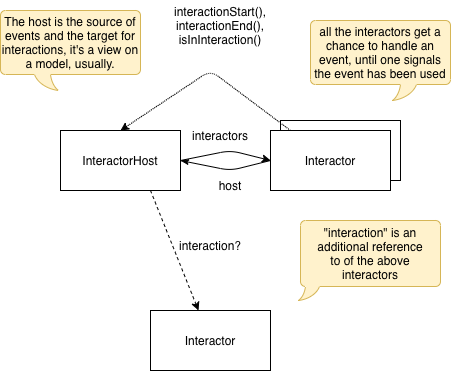

# Interactors: A Composite Event Handler Pattern

An attempt to implement an architectural pattern for event handlers or
tool behaviours for graphical environments. The pattern came originally
from a misunderstanding of what Interactors are in the InterViews
framework. (Let's called it "inspired by".)

The basic idea is that tools for a graphical editor should be composable
but separate units of behavior. For example tools to create selections
and a tool to move around selected shapes should be separate but able
to work together.

Every Interactor is a collection of event handling functions and some small
bit of state. An Interactor can be *active* or *in the middle of an interaction*
or passively waiting for an interaction to start.

A Host for Interactors is some source of events that has a list of interactors.
An InteractorComposite is an implementation of both the Interactor interface 
as well as the InteractorHost interface. This allows interactors to be arranged
into hierarchies, events are handled by visiting all interactors in the order 
of a depth-first traversal. The connection between a view of an editor and
a list of interactors can be implemented by accepting a single interactor 
(make that an InteractorComposite) and then wiring up all event handlers 
on the composite to the event source of the view.

Every event is forwarded to every interactor in the list until one of them
signals that the event has now been handled. If an interactor starts a longer
running interaction by calling `interactionStart(this)` on it's host, it will
receive all incoming events first, but if it doesn't signal that it has used
the event (by calling `preventDefault()`), the event will passed around to 
every interactor in the list. Once an interactor is done running such an
interaction, it must call `interactionEnd(this)` on its host, ending the
interaction and removing itself from the `interaction` slot of the host.

(Some of this code hasn't been written here, yet, but it's how I usually
implement the pattern.)

Why this is great:

- UIs with optional behaviours are easy to implement -- either include an
  interactor in the list of active ones or don't.
- Interactors often end up being relatively simple, and therefore easy to
  reason about.

Why this sometimes isn't so great:

- The actual behaviour is an emergent property of the combination of 
  interactors, making sure all the combinations work as intended can
  be surprisingly difficult.
- Some behaviours can't be created in a modular way (but in those cases one
  ends up with a single interactor that implements the behaviour and that
  isn't really worse than what we would have ended up with, anyway). Usually,
  the ugly bit still ends up smaller than if we hadn't used this pattern.

Challenges -- things I'm currently unhappy with in this implementation attempt:

- Having to declare all the event handlers on the interactor interface 
  is clunky, but it allows every event to only be dispatched to those
  interactors that might be interested.
- The standard DOM UIEvents are the events that this system is supposed to 
  handle, but the whole thing could also be useful in other contexts, 
  e.g. when JS is used as a scripting language for native applications.
  Tying the whole thing to the HTML DOM makes that difficult or impossible.
- Having the event class completely abstract make code navigation difficult.
- The generic way that event delegation is implemented requires the types
  of event handlers to be homogenous.
